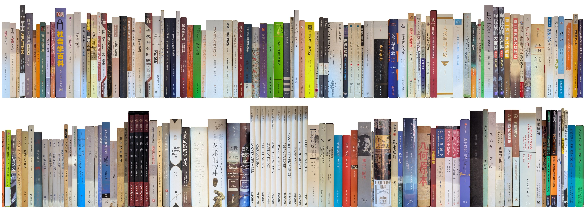
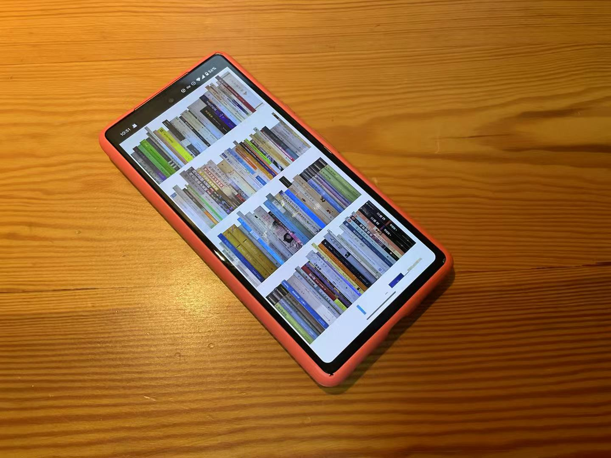
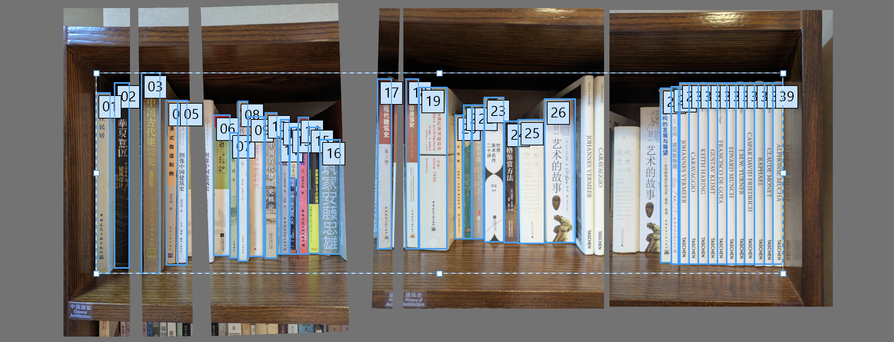

# Shelf


_Shelf 提供了一个快捷的实体书籍统计和管理方式。_

 
_通过推送到Github，手机上亦可浏览。_

在线案例：https://yefan-zhi.github.io/shelf/

代码：https://github.com/yefan-zhi/shelf

## 缘起

因为长期过着一种双城生活，一直想用某种方式用电脑管理我的书籍，以避免重复购买，并方便（召唤老妈）远程查阅。要求（i）内容由我直接存储，不依赖第三方数据库，保持数据完整性；（ii）录入快捷，避免每本书都要拍照或手动输入；（iii）对书籍有简单的分类和排序，标记。

昨日灵感突现。以往给书架拍照就能掌握大概，何不将这些书架照片有效组织起来？每一张书架的照片可以涵盖二三十本书籍，将每本书独立裁剪出来即可以获得所有书脊照片。这比每本书独立建档（拍照或输入文字）快捷二三十倍。通过这一方式可以将两地的多个书架合并为一个大书架，作为一个网页浏览。

以下介绍使用方式。

## 图片录入

拍摄照片时需要一个大致参照物使得图片高度反映书籍实际高度，例如书架每格高度或某本书高度。书架要塞紧使得每本书都是竖直的，注意避免遮挡。

裁剪每本书这一工作可以以Adobe Illustrator高效完成。首先通过参照物，将照片缩放到实际大小，暂时忽略近大远小的透视形变。
然后以画板框出每一本书。必要时需要旋转图片或补拍。然后导出每一个画框，文件名随意。

不同书架的多张照片可以以常见的32开大小的书籍对应统一大小。透视形变在程序中通过`height ** 0.8`大致修正。


_在Adobe Illustrator中以画框框出每一本书。这一案例包含了三张照片。_

## 分类整理

图片导出之后，分若干主题类别，按以下文件结构整理。亦可在分类文件夹中嵌套多层文件夹。

```
root
├ Shelf.py
├ Main.py
└ catalog
  ├ 类别一
  │ ├ 任意文件名一.jpg
  │ ├ 任意文件名二.jpg
  │ └ ...
  ├ 类别二
  │ ├ 任意文件名一.jpg
  │ ├ 任意文件名二.jpg
  │ └ ...
  └ ...
```

分类方式我参考的是中国图书馆图书分类法，即《中图法》：https://www.clcindex.com/ 。
这样相近主题会比较接近，不必自己定顺序。每本书的具体分类以自己理解为准，不追求精确。

## 网页生成

程序十分简单，由Python写就，用到了[Pillow](https://pypi.org/project/pillow/)库。
`Main.py`初始化中设置远程github库地址。
程序运行后共生成两个文件`Shelf.html`和`index.html`，分别为本地和推送后的网页。
如果有pdf文件可以以相同文件名存在相同位置，图片超链接到对应文件。
此外程序输出总书籍数。

